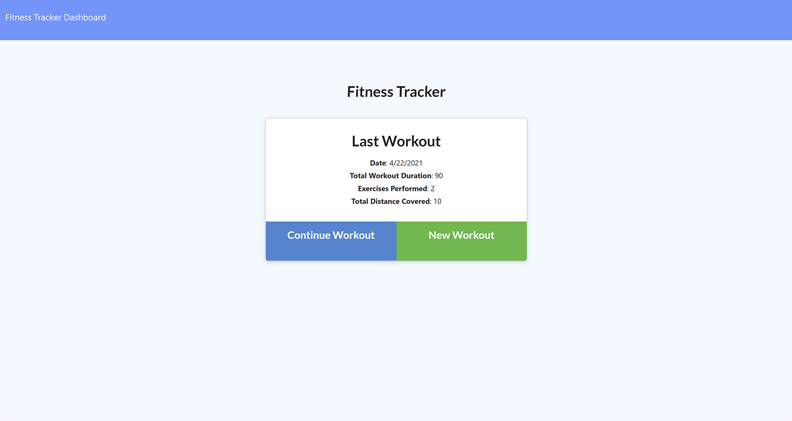
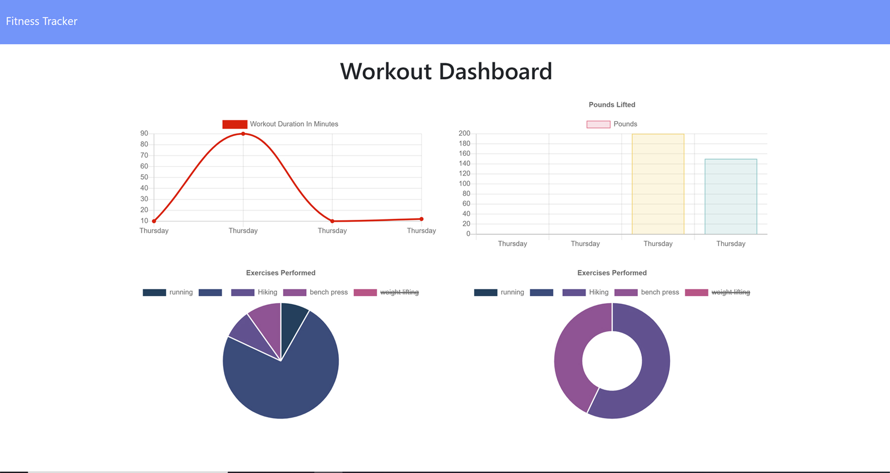

# Workout Tracker

Create a workout tracker using Mongo database with a Mongoose schema and handle routes with Express. This app will help consumers reach their fitness goals more quickly when they track their workout progress.

## User Story

As a user, I want to be able to view create and track daily workouts. I want to be able to log multiple exercises in a workout on a given day. I should also be able to track the name, type, weight, sets, reps, and duration of exercise. If the exercise is a cardio exercise, I should be able to track my distance traveled.

## Screenhots and Demo

## Links

* [Application deployed at live URL (Heroku)](https://hanh-fitness-tracker.herokuapp.com/)

* [GitHub repository with application code](https://github.com/hanhle1989/NoSQL-Workout-Tracker)
